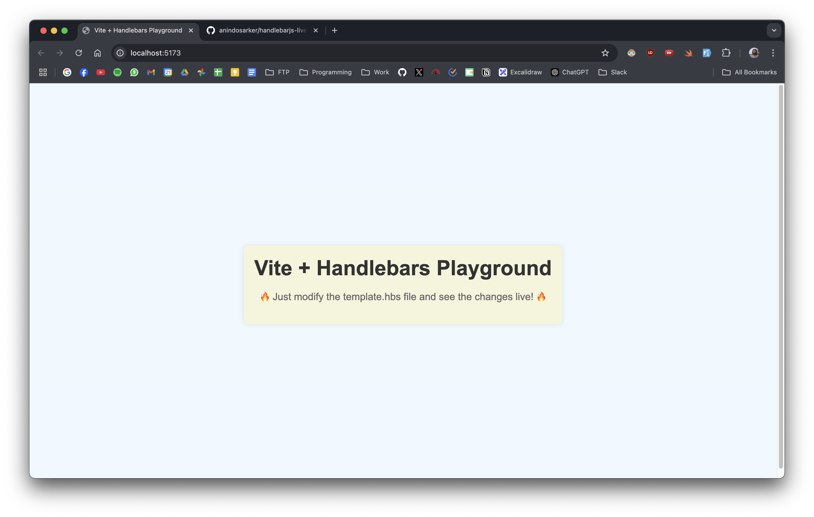

# Handlebars.js Live Editor

This project is a Handlebars.js live editor to test out compiled templates with hot reload. It allows you to edit Handlebars templates and see the changes live in the browser.



## Steps to Get Started

1. **Install Dependencies**:
   ```sh
   npm install
   ```

2. **Run the Development Server**:
   ```sh
   npm run dev
   ```

3. **Open the Live Editor**:
   Open your browser and navigate to [http://localhost:5173/](http://localhost:5173/).

4. **Edit the Template**:
   Edit the template live on `src/templates/template.hbs`. Any changes you make will be reflected in the browser immediately.

5. **Style Modifications**:
   - Modify the styles by editing `src/templates/template-style.css`.
   - Alternatively, you can use inline CSS within the `template.hbs` file to modify the styles directly.

## Example Template (`src/templates/template.hbs`)

```handlebars
<html lang="en">
  <head>
    <meta charset="UTF-8" />
    <link rel="icon" type="image/svg+xml" href="/vite.svg" />
    <meta name="viewport" content="width=device-width, initial-scale=1.0" />
    <title>{{title}}</title>
    <link rel="stylesheet" href="/src/templates/template-style.css" />
  </head>
  <body>
    <div id="app">
      <h1>{{title}}</h1>
      <p>{{description}}</p>
    </div>
    <ul class="card">
      {{#each items}}
        <li>{{this.name}}: ${{this.price}}</li>
      {{/each}}
    </ul>
  </body>
</html>
```

## Example Styles (`src/templates/template-style.css`)

```css
body {
  font-family: Arial, sans-serif;
  background-color: #f0f0f0;
  margin: 0;
  padding: 20px;
}
h1 {
  color: #333;
}
ul {
  list-style-type: none;
  padding: 0;
}
li {
  background-color: #fff;
  margin: 5px 0;
  padding: 10px;
  border: 1px solid #ddd;
}
```

Enjoy editing your Handlebars templates with live reload!
